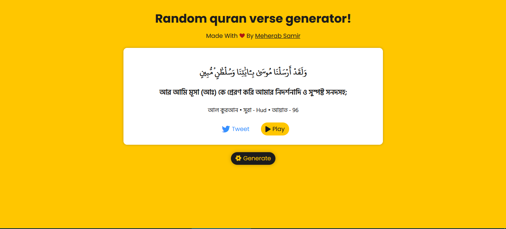

# Random Quran Verse Generator
Random Quran Verse Generator By [Meherab Samir][Github Link]

Tecnologies Used
- HTML
- CSS
- JAVASCRIPT 

Learning Outcome
- Working with API
- Javascript Fetch API

Special Credit
- [Quran.com][Quran.com]
- [Alquran.cloud][Al-Quran.cloud]

 

![Github][Github-sheild]
![][Code-sheild]

### Preview Image
 

[][Live Demo]

Contact me - [meherabsamir.me@gmail.com](mailto:meherabsamir.me@gmail.com)

[![Twitter][Twitter-shield]][Twitter]
[![Facebook][Facebook-sheild]][Facebook]
[![Instragram][Instagram-sheild]][Instagram]

<!-- Links -->
[Github Link]: https://github.com/MeherabSamir

[Live Demo]: https://randomquranverse.netlify.app/ "Click to see live demo."

[Twitter]:https://twitter.com/MeherabSamir

[Twitter-shield]: https://img.shields.io/twitter/follow/MeherabSamir?label=MeherabSamir&style=social

[Instagram]: https://instragram.com/meherab_samir

[Instagram-sheild]: https://img.shields.io/badge/Instragram-Meherab%20Samir-%233690ff?logo=instagram&style=social

[Facebook]:https://www.facebook.com/mohammadsamir.meherab/

[Facebook-sheild]: https://img.shields.io/badge/Facebook-Meherab%20Samir-%233690ff?logo=facebook&style=social

[Github-sheild]:https://img.shields.io/github/watchers/MeherabSamir/Random-Quran-Verse-Generator?style=social

[Code-sheild]:https://img.shields.io/tokei/lines/github/MeherabSamir/Random-Quran-Verse-Generator?color=%233690ff&logo=github?logo=appveyor

[Quran.com]: https://quran.com/

[Al-Quran.cloud]: https://alquran.cloud/